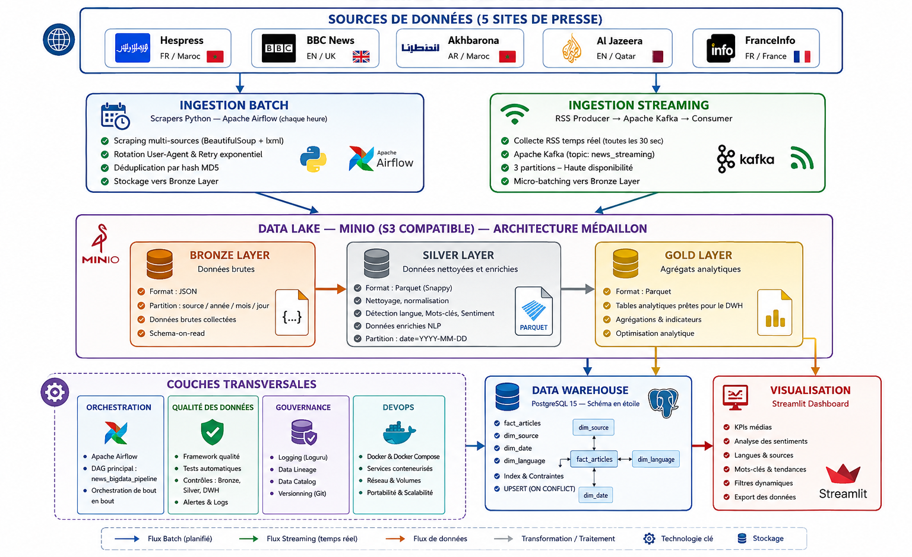

# Projet News Big Data


## Description du projet

`projet_news_bigdata` est une plateforme Big Data d’analyse de médias qui automatise la collecte, le stockage, la transformation et la visualisation d’articles de presse provenant de plusieurs sources web. Le projet met en œuvre une Architecture Médaillon (Bronze / Silver / Gold), un Data Lake MinIO, un Data Warehouse PostgreSQL, une orchestration Apache Airflow et un Dashboard Streamlit.

L’objectif pédagogique est de présenter un pipeline de données de bout en bout, depuis l’acquisition d’articles jusqu’à leur exploitation analytique.

## Objectifs

- Collecter automatiquement des articles depuis plusieurs sites d’actualité.
- Centraliser les données brutes dans un Data Lake MinIO.
- Transformer et enrichir les contenus avec un traitement NLP simple.
- Produire des données analytiques consolidées via une Architecture Médaillon (Bronze / Silver / Gold).
- Charger les résultats dans un Data Warehouse PostgreSQL.
- Orchestrer l’ensemble du pipeline avec Apache Airflow.
- Visualiser les indicateurs dans un Dashboard Streamlit.

## Architecture globale

Le pipeline principal suit le flux suivant :

`Sources Web -> Scrapers -> Kafka / ingestion -> Bronze -> Silver -> Gold -> PostgreSQL DWH -> Streamlit Dashboard`



## Architecture technique

Le projet suit une architecture distribuée conteneurisée basée sur Docker Compose.

Chaque composant est isolé dans un service dédié :

- ingestion
- orchestration
- stockage
- streaming
- visualisation
- Data Warehouse

Cette approche facilite :

- la portabilité
- la reproductibilité
- la maintenance
- le déploiement

## Schéma textuel de l’architecture

```text
+---------------------------+
| Sources de données web    |
| BBC, Hespress, FranceInfo |
| Al Jazeera, Akhbarona     |
+-------------+-------------+
              |
              v
+---------------------------+
| Scrapers Python           |
| + ingestion streaming     |
| via Kafka                 |
+-------------+-------------+
              |
              v
+---------------------------+
| Data Lake MinIO           |
| Bronze : JSON bruts       |
| Silver : Parquet enrichi  |
| Gold   : Parquet analytique|
+-------------+-------------+
              |
              v
+---------------------------+
| Data Warehouse PostgreSQL |
| Schéma analytique         |
+-------------+-------------+
              |
              v
+---------------------------+
| Dashboard Streamlit       |
| KPIs, langues, sentiments |
| sources, mots-clés        |
+---------------------------+

Orchestration transversale : Apache Airflow
Contrôle qualité           : quality/data_quality_checks.py
Gouvernance documentaire   : governance/data_catalog.md
```

## Technologies utilisées

| Technologie              | Rôle dans le projet                               |
| ------------------------ | -------------------------------------------------- |
| Python                   | Développement des scrapers, ETL, NLP et dashboard |
| Docker / Docker Compose  | Conteneurisation et lancement des services         |
| Apache Airflow           | Orchestration du pipeline                          |
| Apache Kafka             | Couche d’ingestion et de streaming                |
| Zookeeper                | Coordination Kafka                                 |
| MinIO                    | Data Lake compatible S3                            |
| PostgreSQL               | Data Warehouse analytique                          |
| Streamlit                | Dashboard de visualisation                         |
| Pandas                   | Manipulation et transformation des données        |
| Plotly                   | Visualisations interactives                        |
| SQLAlchemy               | Connexion et chargement vers PostgreSQL            |
| BeautifulSoup / Requests | Web scraping                                       |
| LangDetect / NLP simple  | Détection de langue, mots-clés et sentiment      |

## Structure du dossier

La structure observée dans le dépôt est la suivante :

```text
projet_news_bigdata/
|
|-- dags/
|-- dashboards/
|-- data/
|-- governance/
|-- logs/
|-- medallion/
|-- quality/
|-- scrapers/
|-- streaming/
|-- warehouse/
|
|-- .env
|-- .env.example
|-- .gitignore
|-- docker-compose.yml
|-- Dockerfile
|-- README.md
|-- requirements.txt
|-- run_all_scrapers.py
```

## Prérequis

Avant de lancer le projet, vérifier les points suivants :

- Docker Desktop doit être installé et démarré.
- Les ports `8080`, `8501`, `9001`, `5433`, `9092` et `2181` doivent être libres.
- Un terminal ouvert dans le dossier racine du projet est nécessaire.
- Le fichier `.env` doit être présent à la racine du projet.
- Le fichier `.env` contient les variables de configuration nécessaires au fonctionnement des services Docker Compose.
- Il est recommandé d’avoir suffisamment d’espace disque pour les volumes Docker.

## Installation

### 1. Se placer dans le projet

```bash
cd projet_news_bigdata
```

### 2. Vérifier la présence du fichier `.env`

Le projet s’appuie sur un fichier `.env` à la racine pour configurer MinIO, PostgreSQL, Kafka et Airflow.

Si besoin, vous pouvez partir de l’exemple fourni :

Sous Linux / macOS :

```bash
cp .env.example .env
```

Sous PowerShell :

```powershell
Copy-Item .env.example .env
```

### 3. Vérifier la configuration Docker Compose

```bash
docker compose config
```

## Exécution avec Docker

Pour un premier lancement, une démonstration propre ou après modification du projet, la commande recommandée est :

```bash
docker compose up -d --build
```

Cette commande :

- reconstruit les images si nécessaire
- démarre les services en arrière-plan
- initialise l’environnement complet

Au premier démarrage, l’initialisation des services peut prendre quelques minutes, en particulier pour Airflow, PostgreSQL et MinIO.

Si vous souhaitez afficher les logs au premier plan pour observer le démarrage :

```bash
docker compose up
```

Pour arrêter les services :

```bash
docker compose down
```

Pour effectuer un redémarrage propre recommandé :

```bash
docker compose down --remove-orphans
docker compose up -d --build
```

Pour repartir complètement de zéro en supprimant aussi les volumes :

```bash
docker compose down -v
docker compose up -d --build
```

## Services d’initialisation

Deux services d’initialisation s’exécutent automatiquement au démarrage :

- `airflow-init` initialise la base Apache Airflow et crée l’utilisateur administrateur.
- `minio-init` crée automatiquement les buckets `bronze`, `silver` et `gold` dans le Data Lake MinIO.

Point important : après leur exécution, l’état `Exited (0)` de `airflow-init` et `minio-init` est normal. Ce ne sont pas des services qui doivent rester actifs en continu.

## Services, URLs et ports

| Service             | URL / accès          | Port hôte | Remarque                     |
| ------------------- | --------------------- | ---------- | ---------------------------- |
| Airflow             | http://localhost:8080 | 8080       | Interface d’orchestration   |
| MinIO Console       | http://localhost:9001 | 9001       | Interface du Data Lake MinIO |
| MinIO API           | http://localhost:9000 | 9000       | API S3 compatible            |
| Streamlit Dashboard | http://localhost:8501 | 8501       | Visualisation finale         |
| PostgreSQL DWH      | `localhost:5433`    | 5433       | Base analytique              |
| Kafka               | `localhost:9092`    | 9092       | Broker de messages           |
| Zookeeper           | `localhost:2181`    | 2181       | Support Kafka                |

## Identifiants par défaut

| Service        | Identifiant    | Mot de passe     |
| -------------- | -------------- | ---------------- |
| Airflow        | `airflow`    | `airflow`      |
| MinIO          | `minioadmin` | `minioadmin`   |
| PostgreSQL DWH | `dwh_admin`  | `dwh_password` |

## Validation rapide après démarrage

Après `docker compose up -d --build`, vérifier rapidement les points suivants :

1. Ouvrir Airflow sur `http://localhost:8080` et se connecter avec `airflow / airflow`.
2. Ouvrir MinIO sur `http://localhost:9001` et se connecter avec `minioadmin / minioadmin`.
3. Ouvrir Streamlit sur `http://localhost:8501`.
4. Vérifier dans MinIO que les buckets `bronze`, `silver` et `gold` existent.
5. Vérifier dans Airflow que le DAG `news_bigdata_pipeline` apparaît.
6. Déclencher le DAG `news_bigdata_pipeline` depuis Airflow pour alimenter MinIO, PostgreSQL et le Dashboard Streamlit.

Si vous souhaitez vérifier l’état des conteneurs :

```bash
docker compose ps
```

## Sources de données

Les sources effectivement prises en charge dans le code sont :

- BBC
- Hespress
- FranceInfo
- Al Jazeera
- Akhbarona

## Pipeline principal Airflow

Le DAG principal est `news_bigdata_pipeline`, défini dans `dags/news_pipeline_dag.py`.

Il orchestre les tâches suivantes :

1. `setup_environment`
2. `scrape_hespress`
3. `scrape_bbc`
4. `scrape_akhbarona`
5. `scrape_aljazeera`
6. `scrape_franceinfo`
7. `bronze_to_silver_transformation`
8. `silver_to_gold_transformation`
9. `load_gold_to_dwh`
10. `data_quality_checks`
11. `prepare_metabase_dashboard`

Remarque : la dernière tâche conserve un nom historique orienté "Metabase" dans le code, mais l’interface de visualisation finale du projet est bien Streamlit. Il ne faut donc pas attendre une interface Metabase active dans cette version.

## Explication du pipeline

### 1. Collecte

Les scrapers Python récupèrent les articles depuis les sites cibles et produisent des enregistrements structurés.

### 2. Ingestion

Le projet contient une couche streaming dans `streaming/`, avec Apache Kafka, notamment `streaming/kafka_to_bronze_consumer.py` et `streaming/rss_producer.py`.

### 3. Bronze

Les données brutes sont stockées dans le Data Lake MinIO sous forme de fichiers JSON. Cette couche conserve les articles dans un état proche de la source.

### 4. Silver

La transformation `medallion/bronze_to_silver.py` applique :

- nettoyage HTML
- validation minimale des articles
- détection de langue
- extraction de mots-clés
- statistiques textuelles
- analyse de sentiment simple

La sortie Silver est stockée au format Parquet.

### 5. Gold

La transformation `medallion/silver_to_gold.py` consolide les données Silver et produit des tables analytiques telles que :

- `articles_by_source`
- `articles_by_language`
- `articles_by_country`
- `articles_by_category`
- `top_keywords`
- `top_keywords_by_language`
- `global_stats`
- `fact_articles`

### 6. Chargement DWH

Le module `warehouse/load_to_dwh.py` charge la table `fact_articles` vers le Data Warehouse PostgreSQL à partir de la couche Gold.

### 7. Qualité

Le module `quality/data_quality_checks.py` exécute des contrôles sur Bronze, Silver et le DWH.

### 8. Visualisation

Le Dashboard Streamlit, défini dans `dashboards/streamlit_app.py`, lit les données depuis PostgreSQL et affiche des indicateurs analytiques.

## Couche Streaming Kafka

Le projet intègre une architecture de streaming basée sur Apache Kafka.

Les producteurs publient les flux RSS et les consommateurs alimentent la couche Bronze du Data Lake MinIO.

Composants principaux :

- `streaming/rss_producer.py`
- `streaming/kafka_to_bronze_consumer.py`

Apache Kafka permet :

- l’ingestion temps réel
- le découplage des composants
- la scalabilité du pipeline
- la résilience des flux de données

## Architecture Médaillon (Bronze / Silver / Gold)

L’architecture Médaillon (Bronze / Silver / Gold) organise les données en trois couches :

### Bronze

- Données brutes issues du scraping ou de l’ingestion
- Format principal : JSON
- Objectif : conserver une trace fidèle de la source

### Silver

- Données nettoyées et enrichies
- Format principal : Parquet
- Objectif : préparer des données fiables et homogènes pour l’analyse

### Gold

- Données consolidées et tables analytiques
- Format principal : Parquet
- Objectif : fournir des jeux de données prêts pour le reporting et le chargement DWH

## Data Lake MinIO

Le Data Lake MinIO joue le rôle de stockage central du projet.

Les buckets `bronze`, `silver` et `gold` sont créés automatiquement au démarrage par le service `minio-init`.

Rôle des couches dans le Data Lake MinIO :

- `bronze` : données brutes issues du scraping ou du streaming
- `silver` : données nettoyées et enrichies
- `gold` : données consolidées et prêtes pour l’analyse

Intérêt de ce choix :

- stockage objet simple à manipuler
- compatibilité S3
- séparation claire des étapes du pipeline
- conservation des données intermédiaires pour audit et rejouabilité

## Data Warehouse PostgreSQL

Le Data Warehouse PostgreSQL est initialisé par `warehouse/schema.sql`.

Le schéma observé comprend :

- `dim_source`
- `dim_language`
- `dim_date`
- `fact_articles`

Ce modèle permet :

- l’analyse par source
- l’analyse par langue
- l’analyse temporelle
- le suivi des sentiments, mots-clés et volumes d’articles

## Dashboard Streamlit

Le Dashboard Streamlit affiche notamment :

- le nombre total d’articles
- la répartition par source
- la distribution par langue
- l’analyse de sentiment
- les mots-clés tendance
- un tableau détaillé des articles

Point important : le Dashboard Streamlit dépend du chargement réussi du Data Warehouse PostgreSQL. Si le DWH est vide ou si le chargement Gold vers PostgreSQL n’a pas abouti, le Dashboard Streamlit ne pourra pas afficher correctement les résultats.

## Résultats obtenus

Le pipeline permet :

- la collecte automatisée d’articles multilingues
- le stockage des données dans un Data Lake MinIO
- la transformation des données via une architecture Médaillon (Bronze / Silver / Gold)
- l’analyse de sentiment des articles
- l’extraction de mots-clés tendances
- la visualisation interactive des données via Streamlit
- l’orchestration complète avec Apache Airflow

## Qualité et gouvernance des données

Le projet contient deux briques dédiées :

- `quality/` pour les contrôles automatiques de qualité
- `governance/` pour la documentation de gouvernance et de dictionnaire de données

Les contrôles de qualité couvrent principalement :

- la présence des fichiers Bronze
- la présence des titres, contenus et URLs
- la détection correcte des langues
- l’extraction des mots-clés
- la cohérence des scores de sentiment
- l’absence de doublons logiques
- l’intégrité référentielle dans le DWH

Le document `governance/data_catalog.md` sert de base de gouvernance documentaire pour décrire les données, leur usage et leur traçabilité.

## Captures d’écran

Cette section peut être complétée avant la soutenance avec des captures réelles du projet.

### Airflow

- DAG `news_bigdata_pipeline`
- exécution complète du pipeline

### MinIO

- buckets `bronze`, `silver` et `gold`

### Streamlit

- dashboard Streamlit analytique interactif
- analyse des sentiments
- tendances des mots-clés

## Commandes utiles

```bash
docker compose config
docker compose up -d --build
docker compose down
docker compose down --remove-orphans
docker compose down -v
docker compose ps
```

Commande utile supplémentaire selon le contexte :

```bash
python run_all_scrapers.py
```

## Dépannage

### 1. Docker ne démarre pas

- Vérifier que Docker Desktop est bien lancé.
- Vérifier qu’aucun message d’erreur n’apparaît dans l’état Docker.

### 2. Les ports sont déjà utilisés

Vérifier que les ports suivants sont libres avant le lancement :

- `8080`
- `8501`
- `9001`
- `5433`
- `9092`
- `2181`

En cas de conflit, fermer le service qui utilise déjà le port ou modifier le mapping dans `docker-compose.yml`.

### 3. Airflow n’est pas accessible

- Attendre quelques minutes après `docker compose up -d --build`.
- Vérifier l’état des conteneurs avec `docker compose ps`.
- Vérifier que `airflow-init` apparaît bien en `Exited (0)`, ce qui est normal.
- Effectuer un redémarrage propre si besoin :

```bash
docker compose down --remove-orphans
docker compose up -d --build
```

### 4. MinIO est accessible mais les buckets n’existent pas

- Vérifier que `minio-init` s’est bien exécuté.
- Vérifier que `minio-init` est en `Exited (0)`, ce qui est normal après création des buckets.
- Relancer proprement l’environnement si nécessaire :

```bash
docker compose down --remove-orphans
docker compose up -d --build
```

### 5. Les scrapers ne collectent rien

Si aucune nouvelle donnée n’est récupérée :

- vérifier que les sites sources sont accessibles et n’ont pas changé leur structure HTML
- vérifier les logs Airflow des tâches `scrape_*`
- supprimer le fichier `logs/seen_articles.txt` pour autoriser une nouvelle collecte visible

Ce fichier sert à éviter les doublons déjà vus. Le supprimer permet de relancer une collecte complète.

### 6. Le Dashboard Streamlit est vide

- Vérifier que le DAG `news_bigdata_pipeline` est visible dans Airflow.
- Vérifier qu’au moins une exécution du pipeline a réussi jusqu’à `load_gold_to_dwh`.
- Vérifier que PostgreSQL contient des données dans `fact_articles`.
- Vérifier dans MinIO que les couches `bronze`, `silver` et `gold` contiennent bien des fichiers.

En pratique, un Dashboard Streamlit vide signifie le plus souvent que :

- les scrapers n’ont pas produit de nouvelles données
- les transformations Bronze vers Silver ou Silver vers Gold ont échoué
- le chargement Gold vers PostgreSQL n’a pas abouti

### 7. Besoin de repartir proprement

Si l’environnement est incohérent ou si vous souhaitez relancer une démonstration propre :

```bash
docker compose down --remove-orphans
docker compose up -d --build
```

Si vous souhaitez supprimer également les volumes pour repartir de zéro :

```bash
docker compose down -v
docker compose up -d --build
```

## Important

- `logs/seen_articles.txt` peut bloquer une nouvelle collecte visible si les articles ont déjà été mémorisés.

## Auteur

Projet réalisé dans le cadre d’un projet académique Big Data / Data Engineering.
Spécialité : Intelligence Artificielle & Data Science.

Ce projet illustre la conception d’une chaîne de traitement de données moderne combinant scraping, ingestion, Data Lake, architecture Médaillon (Bronze / Silver / Gold), entreposage analytique, orchestration et visualisation.
